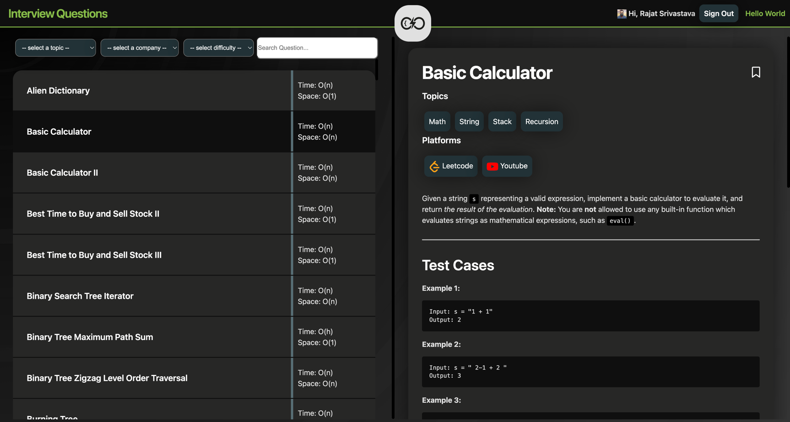
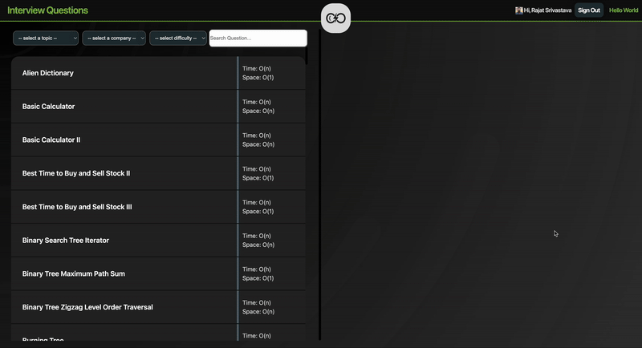

# Interview Questions


A collection of top interview questions asked in DSA rounds of companies. The project is build over jekyll.

The project contains solutions of the questions in multiple languages, the questions are also tagged with topics and companies.

See list of supported languages and platforms, check
1. [languages](_data/languages.yml)
2. [platforms](_data/platforms.yml)

Folks can also login using google (supported through Firebase) and bookmark questions and view their bookmarked questions.

Website: [interview-questions](https://rajat19.github.io/interview-questions/)





Questions are present inside [posts](/posts) folder, with their working solutions available in [code](_includes/code) folder

### Sample coding question post [hello-world.md](/hello-world.md)

```markdown
---
layout: post
title: Hello World
topics: string
langs: java py c cpp go js php cs rb rust scala kt
tc: O(1)
sc: O(1)
leetid: 0
---

Print Hello appended by input string

---

## Test Cases

**Input:** 
	
	(string) s = "World"

**Output:** 

	(string) "Hello World"
```

### Setup:
The project is build over `jekyll` and `ruby`

Ruby setup is complex on macbook so it is recommended to use `rbenv` or `rvm` to manage ruby versions.
Check GitHub pages supported ruby versions [here](https://pages.github.com/versions/).
1. Install `rbenv`
   ```shell
   brew install rbenv
   ```
2. Install ruby latest version
   ```shell
   rbenv install 3.3.4
   ```
3. Set the local ruby version for the project
   ```shell
    rbenv local 3.3.4
    ```
4. Add rbenv ruby path to your shell configuration file (e.g., `~/.bashrc`, `~/.zshrc`)
   ```shell
   echo 'export PATH="$HOME/.rbenv/bin:$PATH"' >> ~/.bashrc
   echo 'eval "$(rbenv init -)"' >> ~/.bashrc
   source ~/.bashrc
   ```

To start the project
1. Install bundles using
   ```shell
   bundle install
   ```
2. Serve the website (using local bundle files)
   ```shell 
   bundle exec jekyll serve
   ```