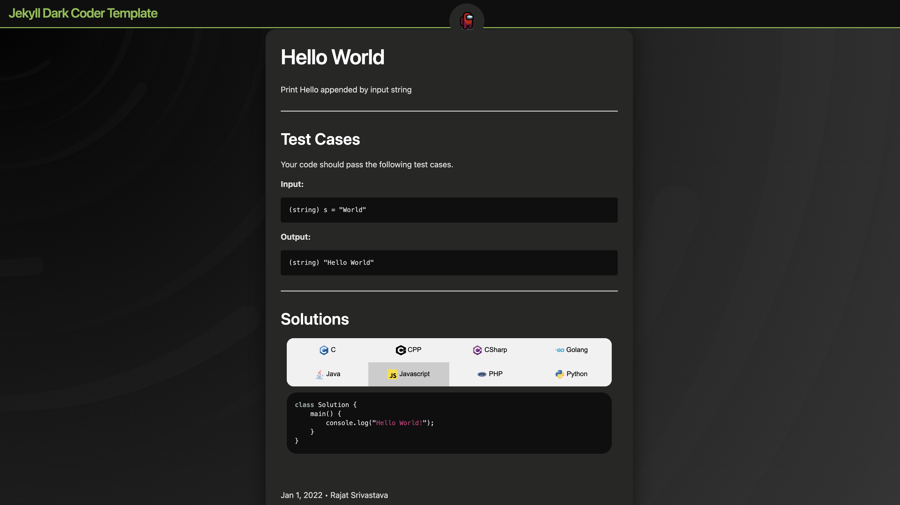

# jekyll-dark-coder-template
Dark Theme template for creating jekyll websites

This is a basic template for [Jekyll](https://jekyllrb.com/) which can be used to make your own websites having coding solutions
The template supports code highlights in most of the languages that are commonly used in coding compteitions.
Raise a issue request or a PR if any new language needs to be added as well

## Language supported
- C
- Cpp
- CSharp
- Java
- Javascript
- Golang
- PHP
- Python
- Ruby (not enabled)

## How to use it
- Clone the repo
- Make changes in [_posts](_posts) folder, by adding new posts with file name in format
`YYYY-MM-DD-<FILENAME>.md`
- Add code/solutions for the posts/questions in [_includes/code](_includes/code) under the folder same as 
the post name i.e. `<FILENAME>.md`
- Add solutions in any language as per your requirement

## Contributing
**Contributions to this repo or any further recommendations are highly appreciated.**
See [Contributing.md](CONTRIBUTING.md)

## Usage Idea (Example)
You can use [Hackerrank Solutions Crawler](https://github.com/Nullifiers/Hackerrank-Solution-Crawler) to fetch for your hackerrnak solutions
And then just create a website using this template that highlights your solutions in different languages
