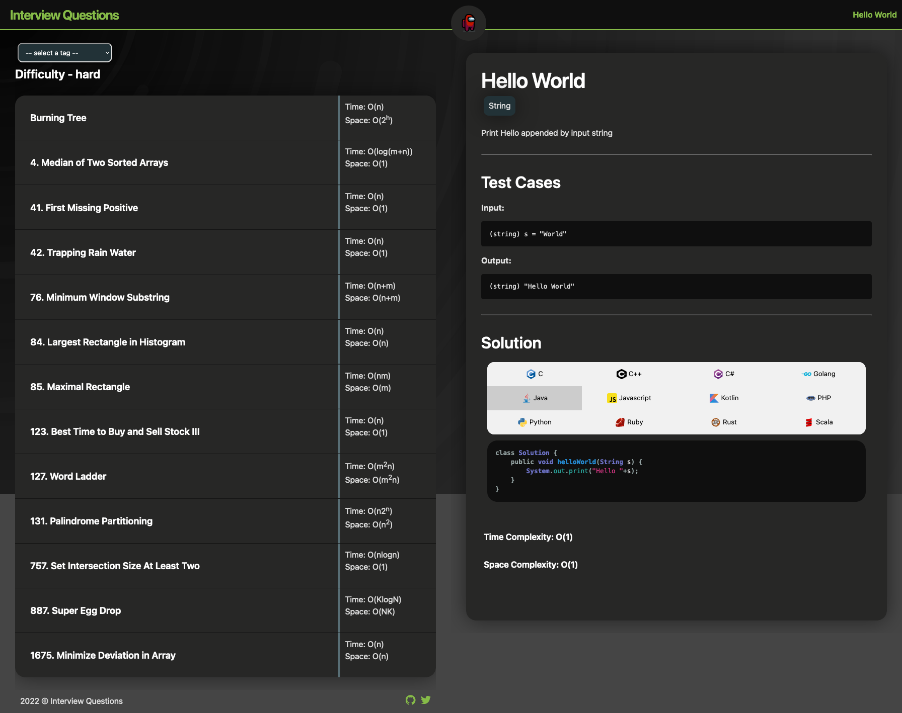
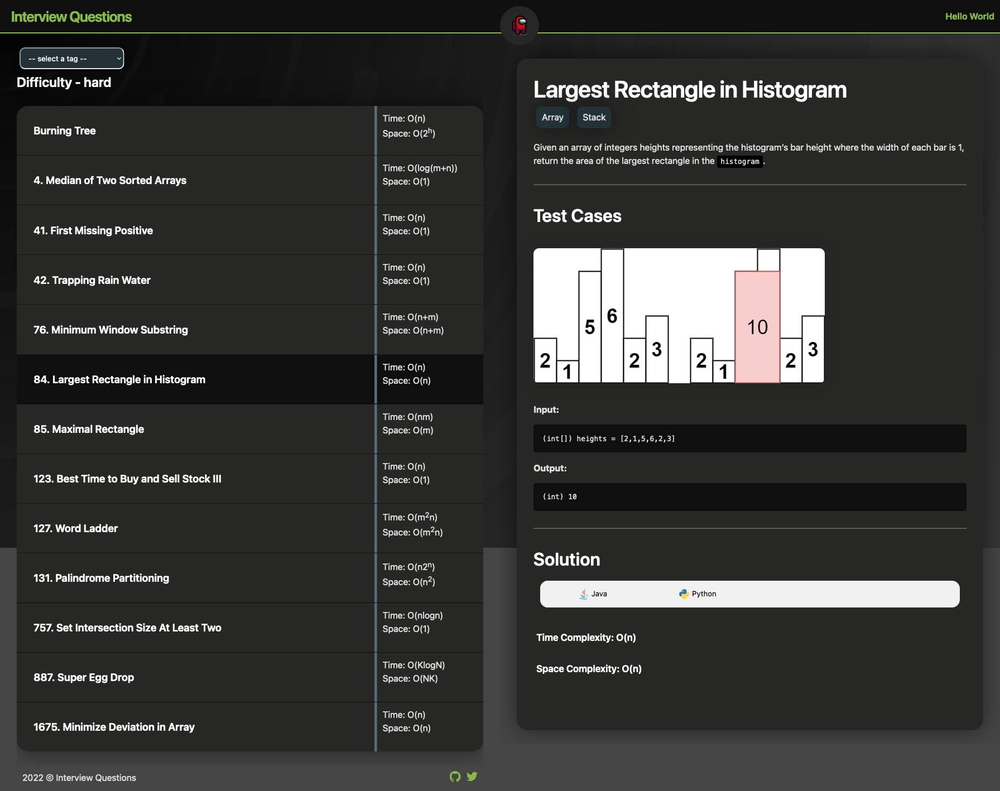

# interview-questions

Website: [interview-questions](https://rajat19.github.io/interview-questions/)





The repository contains solutions to some famous questions asked in interviews.

Questions are present inside [posts](/posts) folder, while their solutions are available in [code](_includes/code) folder

### Sample coding question post [hello-world.md](/hello-world.md)

```markdown
---
layout: post
author: Rajat Srivastava
title: Hello World
tags: string
langs: java py c cpp go js php cs rb rust scala kt
tc: O(1)
sc: O(1)
leetid: 0
---

Print Hello appended by input string

---

## Test Cases

**Input:** 
	
	(string) s = "World"

**Output:** 

	(string) "Hello World"
```

### TODO:
1. Add solutions in most major languages
2. Add `main` method in solutions so that we can test them out
3. Run solutions using [test.sh](/test.sh)
4. Add company tags
5. Add GFG, Leetcode, Interviewbit etc. links for preparation and testing out code