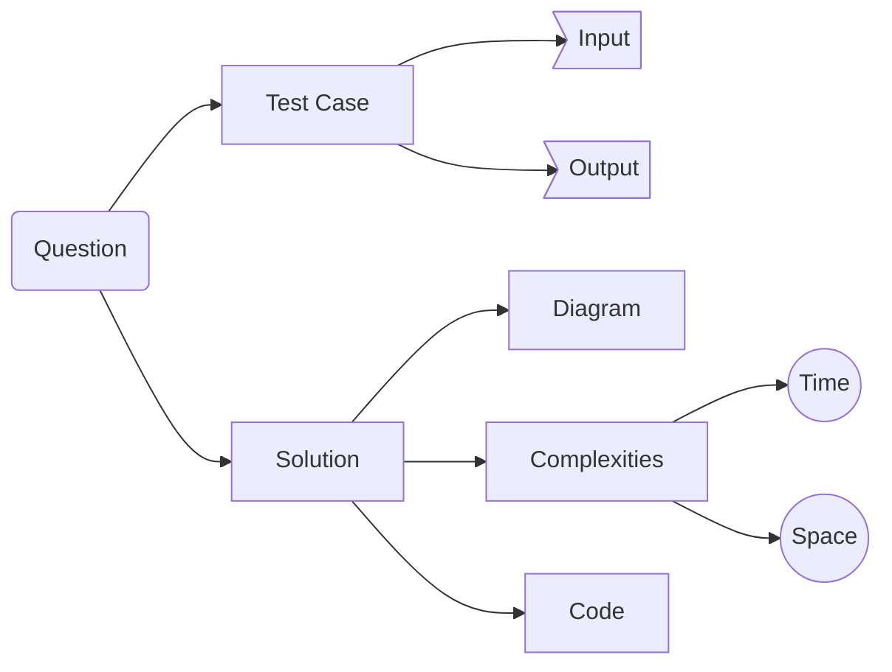

Print Hello appended by input string

Following represents a [mermaid](https://mermaid.js.org/syntax/flowchart.html) diagram


---

## Test Cases

**Input:** 
```
(string) s = "World"
```

**Output:** 
```
(string) "Hello World"
```