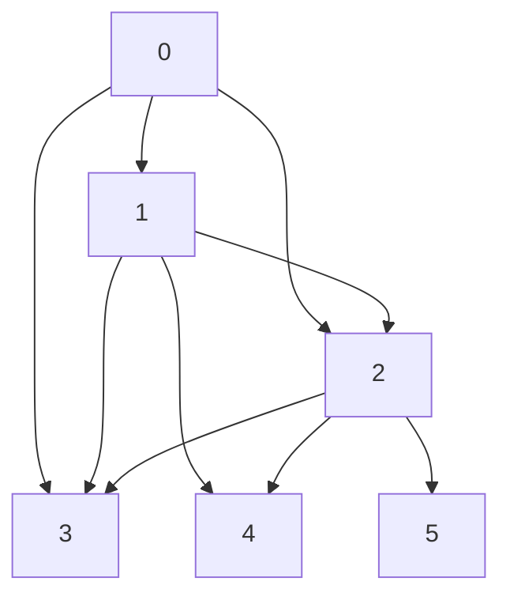

Given an integer array `arr`, partition the array into (contiguous) subarrays of length **at most** `k`. 
After partitioning, each subarray has their values changed to become the maximum value of that subarray.

Return the _largest sum of the given array after partitioning_. Test cases are generated so that the answer fits in a **_32-bit integer_**.

---

## Test Cases

**Example 1:** 
```
Input: arr = [1,15,7,9,2,5,10], k = 3
Output: 84
Explanation: arr becomes [15,15,15,9,10,10,10]
```

**Example 2:** 
```
Input: arr = [1,4,1,5,7,3,6,1,9,9,3], k = 4
Output: 83
```

**Example 2:**
```
Input: arr = [1], k = 1
Output: 1
```

---

## How to Solve

At every index, we need to decide whether to move the element at the index to a new partition or use the existing partition

For the first test case, `arr = [1,15,7,9,2,5,10], k = 3`


From above graph, we can see that we are reusing some of the pre-calculated values. We should proceed with dynamic programming for this

At every index, check for all elements upto `index + k` and find max sum that can be made by multipying the max element in sub-array